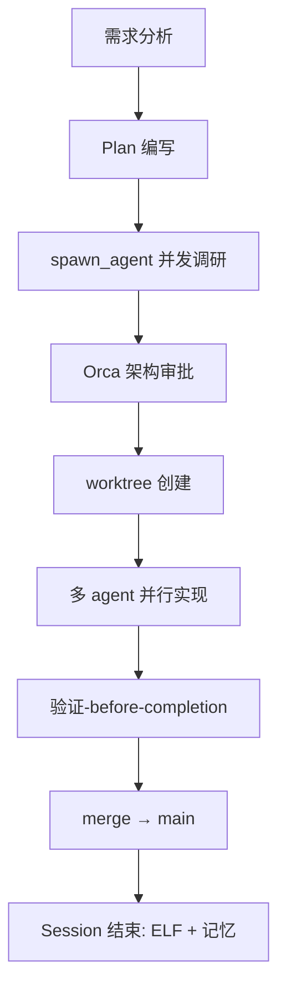

# CrossWave 长期发展规划

## 一、项目现状审计 (2026-06)

### 代码库
| 维度 | 数据 |
|------|------|
| Python 文件 | 98 |
| 测试文件 | 30 |
| 产品线 | 3 (bridge/blog/deploy) + HQ 管理层 |
| 版本 | v1.0.0 (latest) |
| 活跃分支 | main (2 stale feature branches) |
| Docker 服务 | 4 (NocoBase/PG/CrossBlog/SearXNG) |

### 架构状态
| 层 | 状态 | 说明 |
|----|------|------|
| 🟢 数据层 | ✅ 完成 | NocoBase 唯一数据源，CACHE 已删除 |
| 🟢 插件注册 | ✅ 完成 | CrossWavePlugin 合约，5产品自动注册 |
| 🟢 事件总线 | ✅ 完成 | pub/sub + SSE 实时流 |
| 🟢 MCP 标准 | ✅ 完成 | 10 MCP 工具暴露 |
| 🟡 统一入口 | ✅ 完成 | 官网 :9999，后台 :9999/hq/ |
| 🔴 多产品架构 | ❌ 未开始 | 独立 BFF、共享 auth、Nx monorepo |
| 🔴 部署上线 | ❌ 未开始 | SSL/域名/Stripe live |
| 🔴 CI/CD | ❌ 未开始 | 仅基础测试，无部署流水线 |

### 测试覆盖
- 总测试: ~200+ (不含产品线)
- Core tests: ✅ 通过
- HQ tests: ✅ 通过
- 产品线测试: ❌ 缺失 (CrossDeploy: 11 测试，其余 0)

---

## 二、长期规划 (Phase R → Phase Z)

### Phase R — 项目整合 (1-2 周)

将零散产品线整合为统一体系：

**R1: Monorepo 重构**
- 使用 `worktree` 隔离开发
- 创建统一目录结构: `apps/`, `packages/`, `services/`
- 迁移产品线到 `apps/` 下
- 提取共享库到 `packages/` (auth, config, mcp-client)
- 目标: 一个仓库、一个构建系统、一个 CI

**R2: CI/CD 流水线**
- GitHub Actions: lint → test → build → deploy
- 并行测试 (pytest-xdist)
- Docker 镜像构建 & 推送
- 质量门禁: lint 零容忍 + 测试 100% 通过

**R3: 代码质量**
- ruff 全面整治 (当前 ~26 minor)
- mypy 类型检查
- 测试覆盖 >80%
- 删除 stale branches

### Phase S — 多产品 BFF (2-3 周)

**S1: 共享 Auth 服务**
- 统一 JWT 签发 (Clerk/Supabase)
- org_id + app_id 双维度权限
- 跨产品 SSO

**S2: per-product BFFs**
- CrossBridge BFF
- CrossBlog BFF
- CrossDeploy BFF
- 每个 BFF 独立版本、独立部署

**S3: API 网关**
- 统一入口 (当前 :9999)
- 路由分发到 per-product BFFs
- 速率限制 + 缓存

### Phase T — 部署上线 (2-3 周)

**T1: 基础设施**
- 域名 & SSL (Let's Encrypt)
- Nginx 反向代理 (已有配置)
- SMTP 邮件服务
- Sentry 告警激活

**T2: 支付上线**
- Stripe live keys 配置
- Checkout 页面测试
- Webhook 生产验证

**T3: 监控告警**
- Uptime Kuma (已有配置)
- Prometheus + Grafana (已有配置)
- 备份脚本验证

### Phase U — AI OS 深化 (3-4 周)

**U1: AI Agent 工作流**
- Polsia Fork → MCP 深度集成
- 事件驱动跨产品工作流
- AI 自动运维

**U2: 统一搜索**
- SearXNG 整合
- 跨产品知识库
- AI 增强搜索

**U3: 开发者平台**
- MCP 服务市场
- 插件 SDK
- 第三方集成

---

## 三、大项目开发模式

### 工作流程

### 工具规则

| 场景 | 工具 | 说明 |
|------|------|------|
| 新功能 | `worktree_create` | 隔离开发环境 |
| 并发任务 | `spawn_agent` | 多 agent 并行执行 |
| 复杂实现 | `hephaestus` | 代码生成 agent |
| 调研 | `explore` + `librarian` | 代码+社区双路调研 |
| 架构 | `oracle` | 架构评估 |
| 审查 | `ce:review` | 结构化代码审查 |
| 验证 | `verification-before-completion` | 测试+lint+类型全过 |

### PI 规划 (Program Increment)

| PI | 周期 | 主题 | 交付物 |
|----|------|------|--------|
| 1 | 1-2 周 | 整合 (Phase R) | Monorepo + CI + 代码质量 |
| 2 | 2-3 周 | 产品架构 (Phase S) | BFF + 共享 Auth + 网关 |
| 3 | 2-3 周 | 上线 (Phase T) | SSL + 支付 + 监控 |
| 4 | 3-4 周 | AI OS (Phase U) | 工作流 + 搜索 + SDK |

---

## 四、当前优先级

### 🔴 立即执行 (Phase R)

1. **代码质量整治** — ruff 全部修复，mypy 通过
2. **stale branches 清理** — `feature/hq-p*` 删除
3. **Git tag v1.0.0** — 标记当前状态
4. **产品线测试** — 覆盖 blog/bridge 核心路径

### 🟡 本周

5. **CI/CD 基础** — GitHub Actions: lint+test+build
6. **CrossBlog Railway 部署** — 第一个产品上线
7. **共享 auth 设计** — 需求 + 架构评审

### 🟢 本月

8. Monorepo 迁移开始
9. BFF 架构开始
10. 部署上线

---

## 五、决策记录

| # | 决策 | 理由 | 日期 |
|---|------|------|------|
| 1 | NocoBase 唯一数据源 | 稳定运行 6+ 周 | 已执行 |
| 2 | 统一 :9999 入口 | 减少端口混乱 | 已执行 |
| 3 | 插件合约模式 | 可扩展架构 | 已执行 |
| 4 | worktree 隔离开发 | 安全独立开发 | Phase R 开始 |
